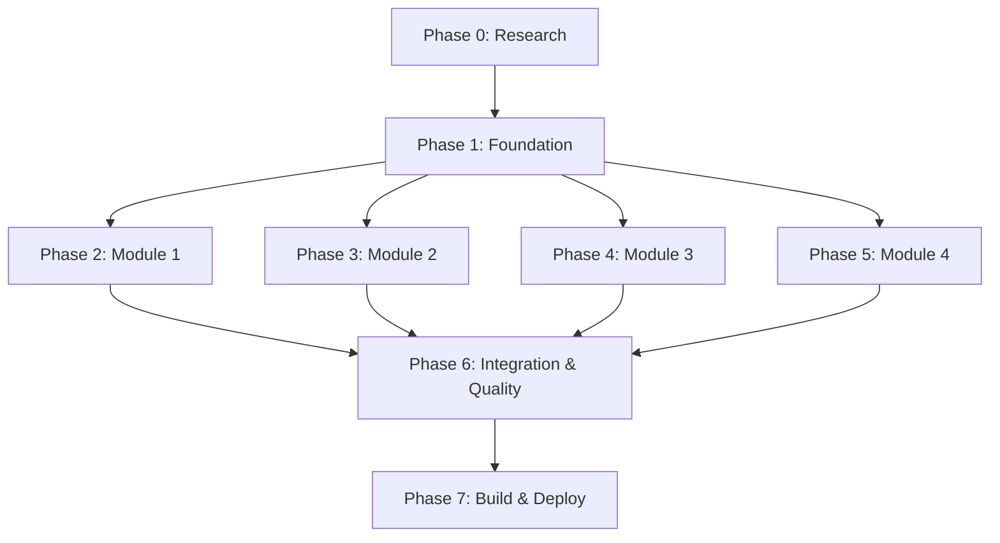

# Tasks: Physical AI & Humanoid Robotics Book

**Branch**: `001-isaac-brain` | **Date**: 2025-12-22  
**Input**: Technical execution plan (plan.md) + Module specifications (spec.md files)  
**Prerequisites**: plan.md, 4 module spec.md files

**Organization**: Tasks are organized by development phase following the spec-driven development workflow: Research → Foundation → Content Development → Integration → Polish

## Format: `[ID] [P?] Description with file path`

- **[P]**: Can run in parallel (different files/modules, no dependencies)
- Include exact file paths in descriptions

---

## Phase 0: Research (Knowledge Gathering & Validation) 🔍

**Purpose**: Resolve all "NEEDS CLARIFICATION" items and establish technical accuracy baseline before content creation

**Goal**: Create comprehensive research.md for each module capturing technical facts, official documentation references, and conceptual frameworks

**Acceptance**: All research artifacts complete, no unresolved clarifications, technical review approved

### Module 1: Physical AI Research

- [X] T001 [P] Create research.md for Module 1 in specs/001-intro-physical-ai/research.md
- [X] T002 [P] Research embodied intelligence definitions and examples from academic sources
- [X] T003 [P] Collect real-world robot failure case studies (autonomous vehicles, warehouse robots)
- [X] T004 [P] Document Physical AI vs Digital AI distinctions with concrete examples
- [X] T005 [P] Research sensor types and their uncertainty characteristics (cameras, IMUs, force sensors)
- [X] T006 [P] Document actuation latency examples and impacts on robot behavior
- [X] T007 [P] Research humanoid form factor advantages and trade-offs with citations

### Module 2: ROS 2 Research

- [X] T008 [P] Create research.md for Module 2 in specs/001-ros2-nervous-system/research.md
- [X] T009 [P] Research ROS 2 architecture documentation (official DDS, middleware, nodes)
- [X] T010 [P] Document communication patterns comparison (topics vs services vs actions)
- [X] T011 [P] Research ROS 2 vs ROS 1 architectural differences from official migration guides
- [X] T012 [P] Document rclpy (Python client library) structure and lifecycle
- [X] T013 [P] Collect ROS 2 node design best practices from official documentation
- [X] T014 [P] Research computational graph introspection tools and visualization

### Module 3: Simulation Research

- [X] T015 [P] Create research.md for Module 3 in specs/001-robot-simulation/research.md
- [X] T016 [P] Research physics engine fundamentals (rigid body dynamics, collision detection)
- [X] T017 [P] Document digital twin concept definitions and applications in robotics
- [X] T018 [P] Research reality gap examples and mitigation strategies from academic papers
- [X] T019 [P] Document sensor simulation approaches (LiDAR ray-casting, RGB-D depth computation)
- [X] T020 [P] Research simulation tools comparison (Gazebo, Unity, Isaac Sim features)
- [X] T021 [P] Document ROS-simulator integration patterns (plugins, bridges, native support)
- [X] T022 [P] Research simulation noise modeling approaches for sensors

### Module 4: Isaac AI Research

- [X] T023 [P] Create research.md for Module 4 in specs/001-isaac-brain/research.md
- [X] T024 [P] Research NVIDIA Isaac ecosystem documentation (Sim, ROS, Lab relationships)
- [X] T025 [P] Document Isaac Sim architecture (Omniverse, USD, RTX rendering)
- [X] T026 [P] Research Isaac ROS perception pipelines (object detection, segmentation, pose estimation)
- [X] T027 [P] Document VSLAM concepts and loop closure problem from SLAM literature
- [X] T028 [P] Research Nav2 architecture and components (global planner, local planner, costmaps)
- [X] T029 [P] Document synthetic data generation strategies (domain randomization, photorealism)
- [X] T030 [P] Research sim-to-real transfer challenges and domain gap mitigation
- [X] T031 [P] Document GPU acceleration benefits for perception pipelines

**Checkpoint**: All research artifacts complete and peer-reviewed for technical accuracy

---

## Phase 1: Foundation (Docusaurus Setup & Structure) 🏗️

**Purpose**: Establish book infrastructure, navigation, and basic structure before content creation

**Goal**: Fully functional Docusaurus site with empty chapter files, proper sidebar navigation, and deployment pipeline

**Acceptance**: Site builds successfully, all navigation works, chapter templates ready, GitHub Pages deployment configured

### Project Initialization

- [ ] T032 Initialize Docusaurus project at repository root with npm/yarn
- [ ] T033 [P] Configure docusaurus.config.js with book metadata (title, tagline, theme)
- [ ] T034 [P] Setup GitHub Pages deployment workflow in .github/workflows/deploy.yml
- [ ] T035 [P] Configure custom CSS for book styling in src/css/custom.css
- [ ] T036 [P] Create static image directories: static/img/module-1/, module-2/, module-3/, module-4/

### Content Structure Setup

- [ ] T037 [P] Create docs/intro.md (landing page with book introduction)
- [ ] T038 [P] Create docs/how-to-use.md (reader guide explaining book structure and learning path)
- [ ] T039 [P] Create module directory structure: docs/module-1-physical-ai/, module-2-ros2/, module-3-simulation/, module-4-isaac/
- [ ] T040 [P] Create _category_.json files for all modules with labels and positions
- [ ] T041 [P] Configure sidebars.js with Part I and Part II sections and module categories

### Chapter File Templates

- [ ] T042 [P] Create chapter template files for Module 1 (4 chapters) with frontmatter and structure placeholders
- [ ] T043 [P] Create chapter template files for Module 2 (5 chapters) with frontmatter and structure placeholders
- [ ] T044 [P] Create chapter template files for Module 3 (4 chapters) with frontmatter and structure placeholders
- [ ] T045 [P] Create chapter template files for Module 4 (4 chapters) with frontmatter and structure placeholders

### Navigation & Build Validation

- [ ] T046 Configure complete sidebar navigation showing all modules and chapters in reading order
- [ ] T047 Test Docusaurus build locally (npm run build) and verify no errors
- [ ] T048 [P] Test navigation flow (prev/next buttons, breadcrumbs, table of contents)
- [ ] T049 [P] Create contributor quickstart guide in specs/001-isaac-brain/quickstart.md

**Checkpoint**: Foundation complete - Docusaurus builds, navigation works, templates ready for content

---

## Phase 2: Module 1 - Introduction to Physical AI (Content Development) ✍️

**Purpose**: Develop conceptual foundation chapters explaining embodied intelligence, physical constraints, robot architecture, and humanoid form factors

**Goal**: Complete, peer-reviewed chapters ready for test reader validation

**User Story Coverage**: US1 (Physical AI Fundamentals - P1), US2 (Robot Architecture - P1), US3 (Humanoid Form Factor - P2), US4 (Simulation Necessity - P2), US5 (Technical Module Preparation - P3)

**Independent Test**: Reader can explain embodied intelligence, diagram robot control loop, justify humanoid design for 3 scenarios, and list 3 reasons for simulation-first approach

### Chapter 1: From Digital AI to Physical AI

- [ ] T050 [P] [US1] Draft Chapter 1 Section 1-2: Opening hook and digital AI success stories in docs/module-1-physical-ai/01-what-is-physical-ai.md
- [ ] T051 [P] [US1] Draft Chapter 1 Section 3-4: Embodiment gap and embodied intelligence definition
- [ ] T052 [P] [US1] Draft Chapter 1 Section 5-7: Physical AI definition, robot failure case studies, chapter summary
- [ ] T053 [US1] Create diagrams for Chapter 1: Digital vs Physical AI pipelines, comparison table in static/img/module-1/
- [ ] T054 [US1] Add reflection questions and misconception callouts to Chapter 1
- [ ] T055 [US1] Peer review and technical accuracy validation for Chapter 1

### Chapter 2: The Physical World as a Constraint

- [ ] T056 [P] [US1] Draft Chapter 2 Section 1-3: Physics constraints, sensor uncertainty, actuation latency in docs/module-1-physical-ai/02-physical-constraints.md
- [ ] T057 [P] [US1] Draft Chapter 2 Section 4-6: Partial observability, determinism vs probabilistic reality, continuous sensing necessity
- [ ] T058 [P] [US4] Draft Chapter 2 Section 7-8: Why simulation matters and chapter summary
- [ ] T059 [US1] [US4] Create diagrams for Chapter 2: Sensor noise illustration, actuation latency timeline, simulation workflow in static/img/module-1/
- [ ] T060 [US1] Add reflection questions and misconception callouts to Chapter 2
- [ ] T061 [US1] Peer review and technical accuracy validation for Chapter 2

### Chapter 3: Anatomy of a Robot

- [ ] T062 [P] [US2] Draft Chapter 3 Section 1-4: Three core components, sensors, compute, actuators in docs/module-1-physical-ai/03-robot-architecture.md
- [ ] T063 [P] [US2] Draft Chapter 3 Section 5-7: Control loop, AI model vs AI system, control frequency
- [ ] T064 [P] [US2] Draft Chapter 3 Section 8: Chapter summary and bridge to Chapter 4
- [ ] T065 [US2] Create diagrams for Chapter 3: Robot component overview, closed-loop control, AI model vs system comparison in static/img/module-1/
- [ ] T066 [US2] Add reflection questions and misconception callouts to Chapter 3
- [ ] T067 [US2] Peer review and technical accuracy validation for Chapter 3

### Chapter 4: Why Humanoids?

- [ ] T068 [P] [US3] Draft Chapter 4 Section 1-4: Human-centric infrastructure, form factor advantage, bipedal locomotion, dexterous manipulation in docs/module-1-physical-ai/04-why-humanoids.md
- [ ] T069 [P] [US3] Draft Chapter 4 Section 5-8: Application domains, trade-offs/alternatives, social acceptance, module conclusion
- [ ] T070 [US3] Create diagrams for Chapter 4: Humanoid anatomy, robot form comparison, human environment examples in static/img/module-1/
- [ ] T071 [US3] Add reflection questions and misconception callouts to Chapter 4
- [ ] T072 [US3] Peer review and technical accuracy validation for Chapter 4

### Module 1 Integration & Polish

- [ ] T073 [US5] Create Module 1 glossary with 20+ key terms in docs/module-1-physical-ai/glossary.md
- [ ] T074 [US5] Write bridge section to Module 2 connecting concepts to ROS 2 in Chapter 4
- [ ] T075 Test Module 1 end-to-end reader flow (landing page → all chapters → Module 2 preview)
- [ ] T076 Module 1 test reader validation (3-5 readers from target audience)
- [ ] T077 Incorporate test reader feedback and finalize Module 1 content

**Checkpoint**: Module 1 complete and validated - Reader understands Physical AI foundations

---

## Phase 3: Module 2 - ROS 2 Nervous System (Content Development) ✍️

**Purpose**: Develop ROS 2 architecture chapters explaining distributed systems, nodes, communication patterns, and Python integration

**Goal**: Complete chapters connecting Physical AI concepts to middleware infrastructure

**User Story Coverage**: US1 (Distributed Architecture - P1), US2 (Communication Patterns - P1), US3 (System Visualization - P1), US4 (Python/AI Integration - P2), US5 (ROS Evolution - P3)

**Independent Test**: Reader can sketch ROS graph for navigation robot, select correct communication pattern for 8/10 scenarios, read basic rclpy code, and list 4 ROS 1 vs ROS 2 differences

### Chapter 1: Why Robots Need Middleware

- [ ] T078 [P] [US1] Draft Chapter 1 Section 1-2: Monolithic robot problem and distributed systems in robotics in docs/module-2-ros2/01-why-middleware.md
- [ ] T079 [P] [US1] Draft Chapter 1 Section 3-4: Middleware solution and nervous system metaphor
- [ ] T080 [US1] Create diagrams for Chapter 1: Monolithic vs distributed architecture comparison in static/img/module-2/
- [ ] T081 [US1] Add thought experiments, reflection questions, and misconception callouts to Chapter 1
- [ ] T082 [US1] Peer review and technical accuracy validation for Chapter 1

### Chapter 2: ROS 2 Architecture

- [ ] T083 [P] [US3] Draft Chapter 2 Section 1-2: What is ROS 2 and Nodes as building blocks in docs/module-2-ros2/02-architecture.md
- [ ] T084 [P] [US3] Draft Chapter 2 Section 3-5: Computational graph, DDS backbone, ROS 2 in robot stack
- [ ] T085 [US3] [US5] Create diagrams for Chapter 2: Node architecture, humanoid robot computational graph (7-10 nodes), ROS 2 stack layers in static/img/module-2/
- [ ] T086 [US3] Add thought experiments (node failure scenarios), reflection questions to Chapter 2
- [ ] T087 [US3] Peer review and technical accuracy validation for Chapter 2

### Chapter 3: Communication Patterns

- [ ] T088 [P] [US2] Draft Chapter 3 Section 1-2: Pattern fundamentals and Topics (pub/sub) in docs/module-2-ros2/03-communication-patterns.md
- [ ] T089 [P] [US2] Draft Chapter 3 Section 3-5: Services (request-response), Actions (goal-feedback), Choosing patterns
- [ ] T090 [US2] Create diagrams for Chapter 3: Topics vs services vs actions comparison, timing diagrams, decision flowchart in static/img/module-2/
- [ ] T091 [US2] Add scenario exercises (10 scenarios for pattern selection), reflection questions to Chapter 3
- [ ] T092 [US2] Peer review and technical accuracy validation for Chapter 3

### Chapter 4: Python Agents and ROS

- [ ] T093 [P] [US4] Draft Chapter 4 Section 1-3: Python in ROS ecosystem, Node anatomy, Publishers in docs/module-2-ros2/04-python-integration.md
- [ ] T094 [P] [US4] Draft Chapter 4 Section 4-6: Subscribers, AI-ROS bridge, Thinking in events
- [ ] T095 [US4] Create diagrams for Chapter 4: Python ROS node architecture, AI agent data flow, traditional vs event-driven comparison in static/img/module-2/
- [ ] T096 [US4] Add annotated code snippets (minimal publisher/subscriber) with detailed comments to Chapter 4
- [ ] T097 [US4] Peer review and technical accuracy validation for Chapter 4

### Module 2 Integration & Polish

- [ ] T098 [US5] Create Module 2 glossary with 24+ ROS terms in docs/module-2-ros2/glossary.md
- [ ] T099 Write bridge section to Module 3 connecting ROS topics to simulation sensors in Chapter 4
- [ ] T100 [P] Test Module 2 end-to-end reader flow and navigation
- [ ] T101 Module 2 test reader validation (3-5 readers with Python/AI background)
- [ ] T102 Incorporate test reader feedback and finalize Module 2 content

**Checkpoint**: Module 2 complete - Reader understands ROS 2 architecture and can design distributed robot systems

---

## Phase 4: Module 3 - Digital Twins & Simulation (Content Development) ✍️

**Purpose**: Develop simulation foundation chapters explaining digital twins, physics engines, sensor simulation, and tool landscape

**Goal**: Complete chapters establishing why simulation is mandatory and how it works

**User Story Coverage**: US1 (Simulation Necessity - P1), US2 (Digital Twins & Physics - P2), US3 (Simulated Sensors - P3), US4 (Tool Comparison - P4)

**Independent Test**: Reader can explain 3 reasons for simulation-first, define digital twin, identify 3 sensor types and their data, compare Gazebo vs Unity on 2 criteria

### Chapter 1: Why Simulation Comes First

- [ ] T103 [P] [US1] Draft Chapter 1 Section 1-4: Safety arguments, cost comparisons, iteration speed, scalability in docs/module-3-simulation/01-why-simulation-first.md
- [ ] T104 [P] [US1] Draft Chapter 1 Section 5-7: Countering hardware-first objections, simulation-first workflow, case studies
- [ ] T105 [US1] Create diagrams for Chapter 1: Cost comparison table, simulation workflow, parallel testing illustration in static/img/module-3/
- [ ] T106 [US1] Add thought experiments (100 robots parallel testing), reflection questions to Chapter 1
- [ ] T107 [US1] Peer review and technical accuracy validation for Chapter 1

### Chapter 2: Physics Engines and Digital Twins

- [ ] T108 [P] [US2] Draft Chapter 2 Section 1-4: Digital twin definition, physics engine fundamentals, rigid body dynamics, reality gap in docs/module-3-simulation/02-physics-digital-twins.md
- [ ] T109 [P] [US2] Draft Chapter 2 Section 5-6: Physics engine limitations, connection to Physical AI constraints
- [ ] T110 [US2] Create diagrams for Chapter 2: Digital twin concept, collision detection illustration, rigid body motion examples in static/img/module-3/
- [ ] T111 [US2] Add reflection questions and misconception callouts (simulation ≠ perfection) to Chapter 2
- [ ] T112 [US2] Peer review and technical accuracy validation for Chapter 2

### Chapter 3: Simulated Sensors and Perception

- [ ] T113 [P] [US3] Draft Chapter 3 Section 1-3: Sensor types (LiDAR, RGB-D, IMU, force-torque), data outputs, noise modeling in docs/module-3-simulation/03-simulated-sensors.md
- [ ] T114 [P] [US3] Draft Chapter 3 Section 4-5: ROS topic integration, sensor limitations in simulation
- [ ] T115 [US3] Create diagrams for Chapter 3: Sensor visualization (point clouds, depth maps), noise comparison, ROS integration diagram in static/img/module-3/
- [ ] T116 [US3] Add reflection questions and sensor failure scenario examples to Chapter 3
- [ ] T117 [US3] Peer review and technical accuracy validation for Chapter 3

### Chapter 4: Simulation Tools Landscape

- [ ] T118 [P] [US4] Draft Chapter 4 Section 1-3: Visualization vs physics distinction, Gazebo strengths, Unity strengths in docs/module-3-simulation/04-tools-landscape.md
- [ ] T119 [P] [US4] Draft Chapter 4 Section 4-5: Isaac Sim preview, ROS integration patterns, tool selection criteria
- [ ] T120 [US4] Create diagrams for Chapter 4: Tool comparison table (Gazebo/Unity/Isaac), selection decision flowchart in static/img/module-3/
- [ ] T121 [US4] Add reflection questions and tool selection scenarios to Chapter 4
- [ ] T122 [US4] Peer review and technical accuracy validation for Chapter 4

### Module 3 Integration & Polish

- [ ] T123 Create Module 3 glossary with simulation terminology in docs/module-3-simulation/glossary.md
- [ ] T124 Write bridge section to Module 4 connecting simulation to AI-driven robotics in Chapter 4
- [ ] T125 [P] Test Module 3 end-to-end reader flow and navigation
- [ ] T126 Module 3 test reader validation (3-5 readers)
- [ ] T127 Incorporate test reader feedback and finalize Module 3 content

**Checkpoint**: Module 3 complete - Reader understands simulation fundamentals and tool landscape

---

## Phase 5: Module 4 - Isaac AI Brain (Content Development) ✍️

**Purpose**: Develop AI-driven robotics chapters covering Isaac ecosystem, perception pipelines, and navigation systems

**Goal**: Complete chapters synthesizing previous modules into AI-driven autonomy

**User Story Coverage**: US1 (AI-Driven Fundamentals - P1), US2 (Isaac Ecosystem - P2), US3 (Perception Pipelines - P3), US4 (Mapping & Navigation - P4), US5 (Synthetic Data - P5)

**Independent Test**: Reader can explain domain gap, diagram Isaac ecosystem, sketch perception pipeline, draw navigation system with feedback loops

### Chapter 1: Why AI Needs Better Simulation

- [ ] T128 [P] [US1] Draft Chapter 1 Section 1-3: Domain gap problem, traditional vs AI perception, photorealism role in docs/module-4-isaac/01-why-better-simulation.md
- [ ] T129 [P] [US1] Draft Chapter 1 Section 4-5: Synthetic data definition, automatic labeling advantages
- [ ] T130 [US1] Create diagrams for Chapter 1: Synthetic vs real image comparison with labels, domain gap illustration in static/img/module-4/
- [ ] T131 [US1] Add thought experiment (1M labeled images), reflection questions to Chapter 1
- [ ] T132 [US1] Peer review and technical accuracy validation for Chapter 1

### Chapter 2: Isaac Sim Overview

- [ ] T133 [P] [US2] Draft Chapter 2 Section 1-3: Omniverse/USD concepts, RTX rendering, Isaac components (Sim/ROS/Lab) in docs/module-4-isaac/02-isaac-sim-overview.md
- [ ] T134 [P] [US2] Draft Chapter 2 Section 4-5: Isaac Sim vs Gazebo comparison, ROS 2 integration
- [ ] T135 [US2] Create diagrams for Chapter 2: Isaac ecosystem architecture, component relationships, comparison table in static/img/module-4/
- [ ] T136 [US2] Add reflection questions and tool selection scenarios to Chapter 2
- [ ] T137 [US2] Peer review and technical accuracy validation for Chapter 2

### Chapter 3: Isaac ROS Pipelines

- [ ] T138 [P] [US3] Draft Chapter 3 Section 1-3: Perception pipeline stages, object detection, semantic segmentation in docs/module-4-isaac/03-isaac-ros-pipelines.md
- [ ] T139 [P] [US3] Draft Chapter 3 Section 4-6: Pose estimation, sensor fusion, GPU acceleration benefits
- [ ] T140 [P] [US3] Draft Chapter 3 Section 7-8: Perception failure modes, ROS 2 integration
- [ ] T141 [US3] Create diagrams for Chapter 3: Perception pipeline data flow, Isaac ROS integration, failure mode examples in static/img/module-4/
- [ ] T142 [US3] Add case study (Isaac ROS performance), reflection questions to Chapter 3
- [ ] T143 [US3] Peer review and technical accuracy validation for Chapter 3

### Chapter 4: Mapping & Navigation

- [ ] T144 [P] [US4] Draft Chapter 4 Section 1-3: VSLAM system overview, loop closure problem, probabilistic maps in docs/module-4-isaac/04-mapping-navigation.md
- [ ] T145 [P] [US4] Draft Chapter 4 Section 4-6: Nav2 architecture, costmaps, path/trajectory planning
- [ ] T146 [P] [US4] Draft Chapter 4 Section 7-9: Localization methods, integrated navigation system, failure case studies
- [ ] T147 [US4] Create diagrams for Chapter 4: VSLAM concept, Nav2 architecture, navigation decision flow, failure scenarios in static/img/module-4/
- [ ] T148 [US4] Add reflection questions and navigation failure analysis scenarios to Chapter 4
- [ ] T149 [US4] Peer review and technical accuracy validation for Chapter 4

### Module 4 Integration & Polish

- [ ] T150 [US5] Integrate synthetic data generation content across chapters (domain randomization, diversity strategies)
- [ ] T151 Create Module 4 glossary with Isaac and navigation terminology in docs/module-4-isaac/glossary.md
- [ ] T152 Write Module 4 synthesis section connecting all concepts and previewing future modules (VLA, sim-to-real)
- [ ] T153 [P] Test Module 4 end-to-end reader flow and navigation
- [ ] T154 Module 4 test reader validation (3-5 readers with AI/robotics background)
- [ ] T155 Incorporate test reader feedback and finalize Module 4 content

**Checkpoint**: Module 4 complete - Reader understands AI-driven robotics and Isaac ecosystem

---

## Phase 6: Cross-Module Integration & Quality Validation 🔗

**Purpose**: Ensure consistency, accuracy, and cohesion across all modules

**Goal**: Book passes all quality gates and is ready for publication

### Cross-Module Consistency

- [ ] T156 [P] Verify consistent terminology usage across all 4 modules with master glossary
- [ ] T157 [P] Validate forward/backward references between modules are accurate
- [ ] T158 [P] Ensure diagram visual language is consistent (colors, notation, style)
- [ ] T159 [P] Verify prerequisite statements align with actual module content

### Technical Accuracy Review (Level 2)

- [ ] T160 [P] Technical expert review: Module 1 Physical AI concepts
- [ ] T161 [P] Technical expert review: Module 2 ROS 2 architecture and patterns
- [ ] T162 [P] Technical expert review: Module 3 Simulation and physics concepts
- [ ] T163 [P] Technical expert review: Module 4 Isaac ecosystem and AI pipelines

### Internal Consistency Audit (Level 3)

- [ ] T164 Trace key concepts across modules (embodied intelligence, control loops, perception)
- [ ] T165 Verify no contradictions in explanations or examples across modules
- [ ] T166 Check that all chapter transitions and bridges are coherent
- [ ] T167 Validate that learning progression makes sense (simple → complex)

### Beginner Accessibility Test (Level 4)

- [ ] T168 Test reader validation: 5 readers with Python background only (no robotics experience)
- [ ] T169 Identify jargon or unexplained terms that block comprehension
- [ ] T170 Verify analogies and examples are accessible to target audience
- [ ] T171 Test reflection questions are answerable using chapter content

### Complexity Jump Detection (Level 5)

- [ ] T172 Analyze chapter-to-chapter difficulty progression within each module
- [ ] T173 Identify any sudden complexity spikes or missing stepping stones
- [ ] T174 Verify concepts are introduced before they're used
- [ ] T175 Check that Module 1 properly prepares for Module 2, Module 2 for Module 3, etc.

### Final Polish

- [ ] T176 [P] Copyedit all modules for grammar, style, clarity
- [ ] T177 [P] Optimize images and diagrams for web and print
- [ ] T178 [P] Add SEO metadata (frontmatter) to all chapter files
- [ ] T179 [P] Generate PDF version of book (optional)
- [ ] T180 Create master glossary combining all module glossaries in docs/glossary.md

**Checkpoint**: All quality gates passed - Book ready for publication

---

## Phase 7: Build, Deploy & Documentation Configuration 🚀

**Purpose**: Configure production build, deployment pipeline, and supporting documentation

**Goal**: Book deployed to GitHub Pages with CI/CD, contributor documentation complete

### Build Configuration

- [ ] T181 Optimize Docusaurus build configuration for production (minification, caching)
- [ ] T182 [P] Configure search plugin (Algolia DocSearch or local search)
- [ ] T183 [P] Add analytics configuration (optional, privacy-respecting)
- [ ] T184 [P] Setup custom domain configuration (if applicable)

### CI/CD & Deployment

- [ ] T185 Finalize GitHub Actions workflow for automatic deployment on main branch push
- [ ] T186 Test deployment pipeline end-to-end (commit → build → deploy → verify)
- [ ] T187 Configure branch protection rules for main branch
- [ ] T188 Setup deployment preview for pull requests (optional)

### Supporting Documentation

- [ ] T189 [P] Create comprehensive README.md at repository root explaining project structure
- [ ] T190 [P] Update contributor quickstart with build/test/deploy instructions
- [ ] T191 [P] Document content creation workflow for future contributors
- [ ] T192 [P] Create ADRs for significant decisions (Docusaurus choice, structure, pedagogy)

### Publication Checklist

- [ ] T193 Run final build and verify no errors or warnings
- [ ] T194 Test site on multiple browsers (Chrome, Firefox, Safari, Edge)
- [ ] T195 Test mobile responsiveness (phone, tablet)
- [ ] T196 Verify all internal links work (no 404s)
- [ ] T197 Verify external links are valid and accessible
- [ ] T198 Create release tag and GitHub release notes
- [ ] T199 Announce publication and share with community

**Checkpoint**: Book published and accessible at production URL

---

## Architectural Decision Records (ADRs) 📋

**Create ADRs during implementation when significant decisions are made**

### Recommended ADRs

- [ ] ADR-001: Choice of Docusaurus over MkDocs, GitBook, Sphinx
- [ ] ADR-002: Module structure and progression (1→2→3→4 order)
- [ ] ADR-003: Conceptual-first approach (no code in Module 1, minimal in Module 2)
- [ ] ADR-004: Isaac ecosystem as primary simulation example vs Gazebo-only
- [ ] ADR-005: ROS 2-first approach (skip ROS 1 except for comparison)
- [ ] ADR-006: Simulation-first pedagogy (Module 3 before hardware)
- [ ] ADR-007: Test reader validation as quality gate

**Location**: Create ADRs in `docs/adr/` or `specs/001-isaac-brain/decisions/`

---

## Dependencies & Execution Order

### Phase Dependencies



### Critical Path

1. **Phase 0 (Research)** → BLOCKS all content creation; must resolve technical questions
2. **Phase 1 (Foundation)** → BLOCKS all module content; structure must exist
3. **Phases 2-5 (Modules)** → Can proceed in parallel after Phase 1 (if staffed), or sequentially (1→2→3→4)
4. **Phase 6 (Integration)** → Requires all modules complete
5. **Phase 7 (Deploy)** → Final step after quality validation

### Module Dependencies

- **Module 1**: No dependencies on other modules (foundational concepts)
- **Module 2**: References Module 1 concepts (Physical AI, embodiment)
- **Module 3**: References Modules 1-2 (sensors, ROS integration)
- **Module 4**: Synthesizes Modules 1-3 (Physical AI + ROS + Simulation)

**Recommendation**: If working sequentially, complete modules in order (1→2→3→4) for natural conceptual flow

### Parallel Opportunities

**Within Phase 0 (Research)**:
- All module research tasks can run in parallel (different modules)

**Within Phase 1 (Foundation)**:
- Setup tasks (T033-T036) can run in parallel
- Directory creation (T037-T040) can run in parallel
- Chapter templates (T042-T045) can run in parallel

**Across Phases 2-5 (Modules)**:
- If multiple writers available, each module can be assigned to different writer
- Module 1, 2, 3, 4 content can be developed concurrently
- Within each module, diagram creation can run parallel to writing

**Within Phase 6 (Quality)**:
- Technical reviews (T160-T163) can run in parallel
- Polish tasks (T176-T179) can run in parallel

**Within Phase 7 (Deploy)**:
- Supporting documentation (T189-T192) can run in parallel

---

## Implementation Strategy

### Strategy 1: Sequential (Single Author or Small Team)

**Best for**: Solo author or small team wanting natural learning progression

```bash
Phase 0: Research (1-2 weeks)
  ↓
Phase 1: Foundation (3-5 days)
  ↓
Phase 2: Module 1 (1-1.5 weeks)
  ↓
Phase 3: Module 2 (1.5-2 weeks)
  ↓
Phase 4: Module 3 (1-1.5 weeks)
  ↓
Phase 5: Module 4 (1.5-2 weeks)
  ↓
Phase 6: Integration (1-2 weeks)
  ↓
Phase 7: Deploy (3-5 days)
```

**Total**: ~8-11 weeks

### Strategy 2: Parallel Modules (Multiple Authors)

**Best for**: Team with dedicated writers per module

```bash
Phase 0: Research (all modules concurrently, 1-2 weeks)
  ↓
Phase 1: Foundation (3-5 days)
  ↓
Phase 2-5: All modules in parallel (4-6 weeks)
  - Writer A: Module 1
  - Writer B: Module 2
  - Writer C: Module 3
  - Writer D: Module 4
  ↓
Phase 6: Integration (1-2 weeks)
  ↓
Phase 7: Deploy (3-5 days)
```

**Total**: ~6-9 weeks

### Strategy 3: MVP First (Minimum Viable Book)

**Best for**: Quick publication with iterative expansion

```bash
Phase 0: Research for Module 1-2 only (1 week)
  ↓
Phase 1: Foundation (3-5 days)
  ↓
Phase 2: Module 1 ONLY (1-1.5 weeks)
  ↓
Phase 3: Module 2 ONLY (1.5-2 weeks)
  ↓
Phase 6: Integration (Module 1-2 only, 3-5 days)
  ↓
Phase 7: Deploy MVP (2-3 days)
  ↓
[Later] Add Modules 3-4 incrementally
```

**MVP**: ~4-5 weeks (Modules 1-2 only)

---

## Validation Checkpoints

### After Phase 0 (Research)
- [ ] All research.md files exist and are complete
- [ ] No "NEEDS CLARIFICATION" items remain
- [ ] Technical review approved for all research artifacts

### After Phase 1 (Foundation)
- [ ] Docusaurus builds without errors
- [ ] All navigation works (sidebar, breadcrumbs, prev/next)
- [ ] All chapter template files exist with proper frontmatter

### After Each Module (Phases 2-5)
- [ ] All chapter markdown files complete and peer-reviewed
- [ ] All diagrams created and properly referenced
- [ ] All reflection questions and misconception callouts included
- [ ] Module glossary complete
- [ ] Test readers (3-5) validate content
- [ ] Bridge section to next module written

### After Phase 6 (Integration)
- [ ] All quality gates passed (5 levels)
- [ ] No contradictions or inconsistencies found
- [ ] Test readers with no robotics background succeed
- [ ] All technical accuracy reviews approved

### After Phase 7 (Deploy)
- [ ] Site deployed and accessible at production URL
- [ ] All browsers and devices tested
- [ ] No broken links or images
- [ ] CI/CD pipeline working

---

## Task Count Summary

- **Phase 0 (Research)**: 31 tasks
- **Phase 1 (Foundation)**: 18 tasks
- **Phase 2 (Module 1)**: 28 tasks
- **Phase 3 (Module 2)**: 25 tasks
- **Phase 4 (Module 3)**: 25 tasks
- **Phase 5 (Module 4)**: 28 tasks
- **Phase 6 (Integration)**: 25 tasks
- **Phase 7 (Deploy)**: 19 tasks

**Total**: 199 tasks

---

## Notes

- **[P] = Parallelizable**: Tasks marked [P] can run simultaneously with other [P] tasks in same phase
- **Tests NOT included**: Per requirements, test tasks are not generated unless explicitly requested
- **User Story Labels**: Tasks reference user stories from module spec.md files for traceability
- **File Paths**: All tasks include absolute or clear relative file paths
- **Commit Strategy**: Commit after each task or logical group (e.g., all chapter sections)
- **Review Points**: Peer review and technical validation after each chapter/module
- **Quality Gates**: Multi-level validation before deployment (accuracy, consistency, accessibility)

---

## Success Criteria

**Module-Level Success** (After Each Phase 2-5):
- Module content complete and validates against spec.md acceptance scenarios
- Test readers achieve 80%+ success on reflection questions
- Technical experts confirm accuracy
- Bridge to next module properly sets context

**Book-Level Success** (After Phase 6):
- All 4 modules integrated cohesively
- No unexplained jargon or accessibility barriers
- Consistent terminology and visual language
- Linear learning progression validated
- Reader can progress from Physical AI concepts → ROS 2 → Simulation → AI-driven autonomy

**Publication Success** (After Phase 7):
- Book deployed and accessible online
- CI/CD pipeline operational
- Mobile-responsive and cross-browser compatible
- No broken links or images
- Community feedback positive

---

**END OF TASKS.MD**
